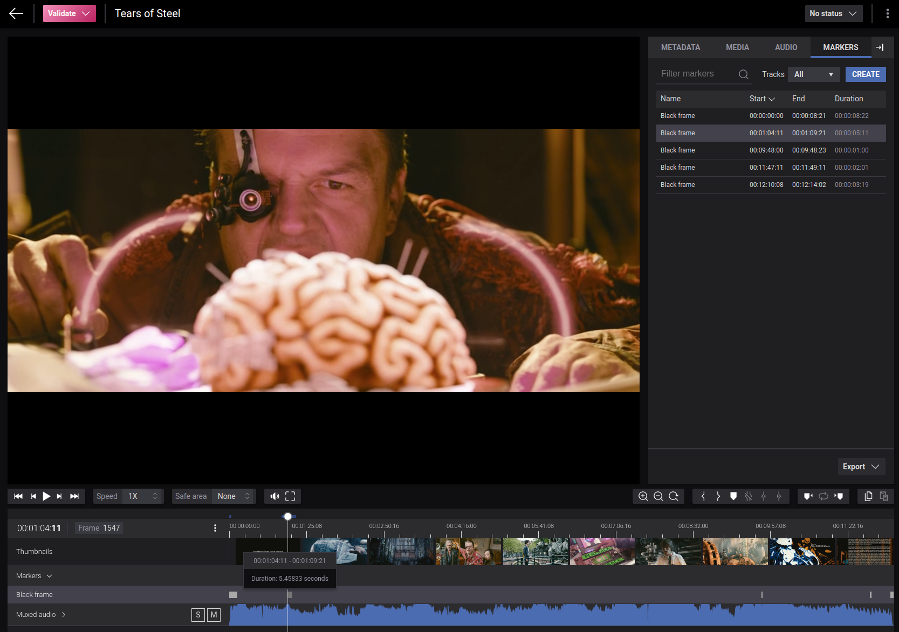
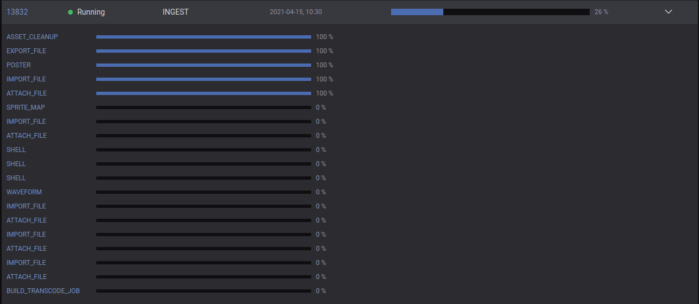

# Black frame detection using FFmpeg in Accurate.Video

This repository contains an integration to FFmpeg for black frame detection during ingest in Accurate.Video. More 
accurately, it will detect video intervals that are (almost) completely black, meaning there need to be many 
subsequent black frames to be flagged as a black interval. The duration and the minimum pixel and frame thresholds 
can be customized using parameters to the black frame detection filter.

The black frame detection will run as part of the video ingest process, where the default job template used for video 
files is modified to include additional steps, defined as shell actions. Although typically executed during ingest, 
the black frame detection can also run on-demand, but that's not covered in this repo. Speed wise, black frame
detection is a relatively quick process, executing at ~17x speed, meaning a 17-minute-long video will take roughly 
1 minute to analyze.

Black frame detection is a widespread use case to visualize as metadata to end-users such as QC operators when
performing validation of content to highlight and suggest chapter transitions, commercials, or invalid recordings.



## FFmpeg blackdetect

FFmpeg has a video filter called _blackdetect_ which can be used specifically for this use case. The filter will
run an analysis on each frame in a video, based on the parameters given. For every matching interval found that is 
within the minimum duration, a line is printed to the normal log output with the start, end, and duration of the 
interval in seconds.

### Usage

Refer to the blackdetect filter in the FFmpeg docs for more details on usage.  
https://ffmpeg.org/ffmpeg-all.html#blackdetect

`black_min_duration, d`  
Set the minimum detected black duration expressed in seconds. Default value is 2.0.

`picture_black_ratio_th, pic_th`  
Set the threshold for considering a picture "black". Default value is 0.98.

`pixel_black_th, pix_th`  
Set the threshold for considering a pixel "black". Default value is 0.10.

```
ffmpeg -i input -vf blackdetect=d=1:pic_th=0.98:pix_th=0.10 -f rawvideo -y /dev/null
```

The above command will detect black frame intervals of at least 1 second of subsequent black frames, where each frame
needs to be 98% black to be considered a black frame, and each pixel has 10% variance from being completely black. This
is a pretty strict setup.

Sample output from Sintel:
```
[blackdetect @ 0x564caad3d380] black_start:0 black_end:3.625 black_duration:3.625
[blackdetect @ 0x564caad3d380] black_start:101.208 black_end:104.083 black_duration:2.875
[blackdetect @ 0x564caad3d380] black_start:146.542 black_end:150.583 black_duration:4.041
[blackdetect @ 0x564caad3d380] black_start:435.458 black_end:438 black_duration:2.542
[blackdetect @ 0x564caad3d380] black_start:676.792 black_end:680.708 black_duration:3.916
[blackdetect @ 0x564caad3d380] black_start:744.083 black_end:756.75 black_duration:12.667
[blackdetect @ 0x564caad3d380] black_start:756.833 black_end:774.708 black_duration:17.875
[blackdetect @ 0x564caad3d380] black_start:781.333 black_end:784.917 black_duration:3.584
```

### Script

A convenient bash-script in `bin/bframe.sh` can be used with the video input file as argument. This script redirects 
the output from FFmpeg into a file called `bframe_output.txt`, which can be parsed in a later stage. Any output to 
stdout is suppressed when using this script.

```
/bframe.sh ~/Videos/Sintel.2010.720p.mkv
Input file: /Videos/Sintel.2010.720p.mkv
```

This script is used in the job template as the first step.

## Parsing

To make the black frame metadata reported by FFmpeg available to use in Accurate.Video, it first needs to be parsed
and converted to the timespan format, which is the internal format used for time-coded metadata. 

To make it easier to parse, this process is handled by a separate Python script, found in `bin/parse_bframe.py`.
The script simply reads from the output file from FFmpeg `bframe_output.txt` and outputs a JSON file in `timespans.json`

Here is an example for a single black frame interval. Each interval will result in many blocks of JSON like this.

FFmpeg output:
```
[blackdetect @ 0x55e3ac098840] black_start:0 black_end:3.625 black_duration:3.625
```

Converted JSON timespan:
```json
[
  {
    "type": "Black_Frame",
    "startSeconds": "0",
    "endSeconds": "3.625",
    "metadata": [
      {
        "key": "name",
        "value": "Black frame"
      },
      {
        "key": "description",
        "value": "Duration: 3.625 seconds"
      },
      {
        "key": "subtype",
        "value": "av:track:video:black_frame"
      }
    ]
  }
]
```

The metadata is stored with the subtype `av:track:video:black_frame`, with a global type of `Black_Frame`. The name 
of the marker is simply `Black frame`, and for description the duration of the interval is used, which will be shown 
when hovering over the marker in the timeline.

What's extremely convenient here is that you can use either frames, seconds, or flicks when submitting metadata, and AV
will automatically convert this based on the frame rate of the asset. In this case, the `startSeconds` and `endSeconds`
are used from the FFmpeg output.

## Ingest template

In order to make AV execute the black frame detection, a custom job template needs to be used. Black frame detection
is only relevant for video files, so we'll only need to modify the video ingest template, which is a partial template
called from the main ingest template. To start with, download the full video ingest template available here: 
https://accurate.video/docs/guides/accuratevideo-templates/#partialsvideo_ingest

At the end of this template, three additional steps have been added, which all have the type `SHELL`, meaning the runner
will execute them as regular shell commands. For simplicity the black frame process has been split into three steps:

* `bframe.sh <file_name>` - runs FFmpeg on asset video file
* `parse_bframe.py` - parses FFmpeg output and converts into timespan format
* `import_timespans.sh <asset_id>` - ingests timespans onto asset

Below are the three additional commands being added to the video ingest template. The full template can be found in
`partials/video_ingest.j2.json`.

```json
{
  "type": "SHELL",
  "metadata": [
    {
      "key": "command",
      "value": "/opt/dynamic-settings/runner-script/bframe.sh"
    },
    {
      "key": "command",
      "value": "${target_path_export}"
    }
  ]
},
{
  "type": "SHELL",
  "metadata": [
    {
      "key": "command",
      "value": "/opt/dynamic-settings/runner-script/parse_bframe.py"
    }
  ]
},
{
  "type": "SHELL",
  "metadata": [
    {
      "key": "command",
      "value": "/opt/dynamic-settings/runner-script/import_timespan.sh"
    },
    {
      "key": "command",
      "value": "{{metadata.target_asset_id}}"
    }
  ]
},
```

Note that the scripts that are uploaded to the runner will execute from `/opt/dynamic-settings/runner-script`, hence 
the prefix to the scripts used here.

### Uploading template & scripts

In order to use the new templates and scripts in AV, we'll need to make the runner process aware of them. This is done
through the settings API, where the template & scripts are uploaded and stored in the database. The runner will 
download them when running a new job. This is explained more in-depth here: https://accurate.video/docs/guides/accuratevideo-templates/#adding-or-overriding-templates-via-the-settings-api  

There are two convenience scripts in the `bin` folder, called `upload_template.py` and `upload_script.py` which can 
be used to upload templates & scripts which are automatically escaped and sent as a blob. The syntax for these two 
scripts are:

```
./upload_template.py <template name> <template filename> <base api url> <user> <password>
./upload_script.py <script name> <script filename> <base api url> <user> <password>
```

Parameters for `upload_template` are:

* template name - the name of the template, without suffix `j2.json`. If a partial template, then prefix is `partials/`
* template filename - file name of the template (on disk)
* base api url - the base AV API URL, without `/api` suffix
* user - user name of runner for authentication with settings API
* password - password of runner for authentication with settings API

Here is an example for uploading a partial video ingest template, and the three scripts. AV API is accessed at 
`https://av.jonas.cmtest.se/API/settings`. Find the replace the runner credentials from AWS Secrets Manager.

```
./upload_template.py 'partials/video_ingest' '../partials/video_ingest.j2.json' 'https://av.jonas.cmtest.se' 'runner' 'xxx'
./upload_script.py 'parse_bframe.py' 'parse_bframe.py' 'https://av.jonas.cmtest.se' 'runner' 'xxx'
./upload_script.py 'bframe.sh' 'bframe.sh' 'https://av.jonas.cmtest.se' 'runner' 'xxx'
./upload_script.py 'import_timespan.sh' 'import_timespan.sh' 'https://av.jonas.cmtest.se' 'runner' 'xxx'
```

When the ingest process runs, there will now be three additional `SHELL` steps in the ingest pipeline.



## Configure timeline

The last required step is to configure the Accurate.Video timeline to show the captured metadata. Include the following 
section in your `settings.js` configuration:

Marker type must match `Black_Frame`, and the marker track `av:track:video:black_frame`.

```javascript
  markers: {
    groups: [
      {
        match: marker => marker && marker.type === "Black_Frame",
        title: "Markers",
        id: "markers",
        readOnly: true,
        alwaysShow: false,
        rows: [
          {
            markerType: "Black_Frame",
            track: "av:track:video:black_frame",
            match: () => true,
            title: "Black frame",
            tooltip: ({ metadata }) => metadata.get("name")
          }
        ],
        markerStyle: _ => ({ backgroundColor: "#A9A9A9" })
      },
      {
        match: () => true, // Default
        id: marker => marker.type,
        title: marker => marker.type,
        alwaysHide: true,
        rows: []
      }
    ],
    markersMetadataSettings: [
      {
        match: () => true, // Default
        mappings: {
          name: "name",
          description: "description",
          trackId: "subtype"
        }
      }
    ],
    tracksMetadataSettings: [
      {
        match: () => true, // Default
        mappings: {
          name: "name",
          description: "description"
        }
      }
    ]
  }
```
